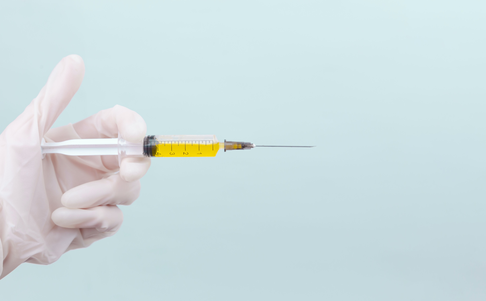

# Chanathip Kulsirilak's Assignments

## 2110507 Software Development Practice II

### Computer Engineering, Chulalongkorn University

***

## Assignment Explanation (in Thai)

### 3. Assignment 03

ผมสร้าง component ที่ชื่อว่า MainBanner ไว้สำหรับแบนเนอร์ในหน้าเพจหลักของเว็บไซต์ โดยใช้ div เป็น container และใช้ CSS กำหนดความกว้างและความสูง จากนั้นด้านในก็ประกอบด้วย 4 element หลักที่อยู่ระดับเดียวกัน ได้แก่ h1, h2, div, และ Image โดยทั้งสามตัวนี้มีหน้าที่แตกต่างกัน แต่ div ในแบนเนอร์นี้จะทำหน้าที่ทำให้รูปภาพค่อย ๆ จางกลายเป็นสีขาวเหมือนกับสีหลักของหน้าเพจ เพื่อความกลมกลืน

### 4. Assignment 04

ผมเปลี่ยน Card component ให้สามารถรับ props เข้ามาได้ จากนั้นก็ดาวน์โหลดรูปภาพที่ถูกเตรียมไว้ลงมาในไดเรคทอรี่ของโปรเจค แล้วก็ทำการแก้ไขส่วนที่เรียกใช้ Card เรียบร้อย

สำหรับในส่วนของ Menu bar ผมเลือกจะออกแบบโดยใช้ flexbox โดยตั้งค่า flex-direction ให้เป็น row-reverse ใช้ Link แทนโลโก้เพราะผมไม่สามารถหาโลโก้ที่เหมาะสมได้ (ผมพิสูจน์ความรู้ความเข้าใจการใช้ Image component ไปแล้วในส่วนของ Card) จากนั้นก็จัดการ routing และตกแต่งจัดวาง layout โดยอาศัยความสามารถของ Tailwind CSS ตามความเหมาะสม

### 5. Assignment 05

ในการบ้านครั้งนี้ ผมไม่ค่อยได้ใช้ component สำเร็จรูปจาก Tailwind UI สักเท่าไหร่ แต่ผมจะเลือกหยิบใช้คลาสบางตัวที่มีประโยชน์และหาเจอได้อย่างอย่าง outline

ส่วนการใช้ DatePicker จาก MUI X นั้น เป็นไปได้ด้วยดีครับ

### 6. Assignment 06

การบ้านครั้งนี้ ผมค่อนข้างเหนื่อยเลยครับ การใช้ useReducer Hook เป็นอะไรที่ใหม่และซับซ้อนมาก แต่ก็สนุกมากเช่นกัน สิ่งหนึ่งที่ผมไม่ชอบเกี่ยวกับการบ้านครั้งนี้คือการใช้ Map ครับ ในตัวอย่าง อาจารย์ใช้ map() ซึ่งเป็นฟังก์ชันของ Array ที่จะ map และคืนค่า array กลับมา แต่ในการบ้านกลับใช้ Map มันทำให้ผมสับสนมาก ๆ ครับ

แต่ถึงอย่างนั้น มันก็คุ้มค่าครับ

### 7. Assignment 07

ในการบ้านครั้งนี้ ผมรู้สึกสนุกกับการทำ Group Routing, Dynamic Routing มาก เป็นเรื่องที่ผมมองว่าน่าสนใจและดูเจ๋งมาก เป็นอีกบทหนึ่งที่เรียนสนุกครับ

(ผมส่งการบ้านครั้งนี้ช้า เนื่องจากเข้าใจผิด)

***

## Assets

### Images

1. An image by [Diana Polekhina](https://unsplash.com/@diana_pole) from [Unsplash](https://unsplash.com)

2. รูปภาพที่ถูกเตรียมไว้สำหรับ Assignment